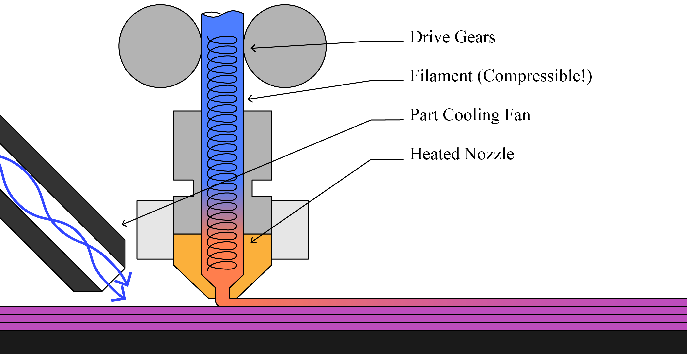
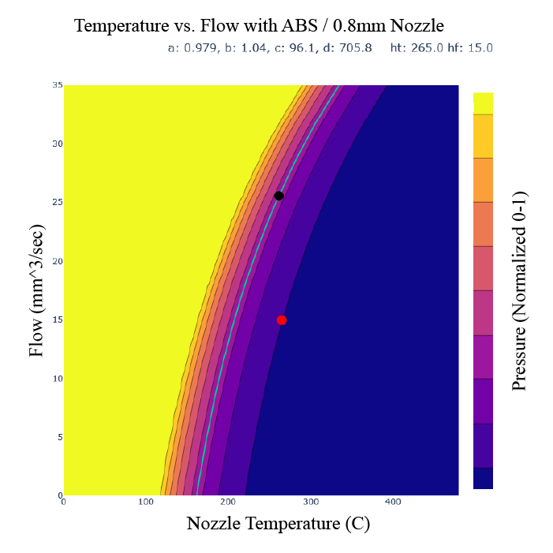
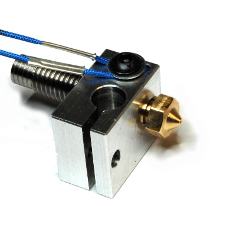
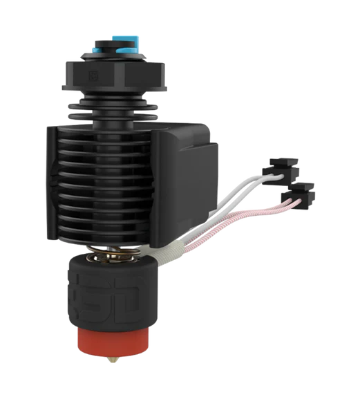
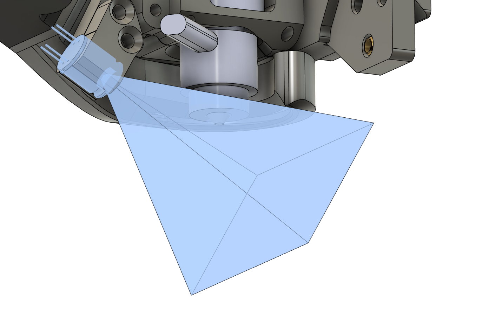
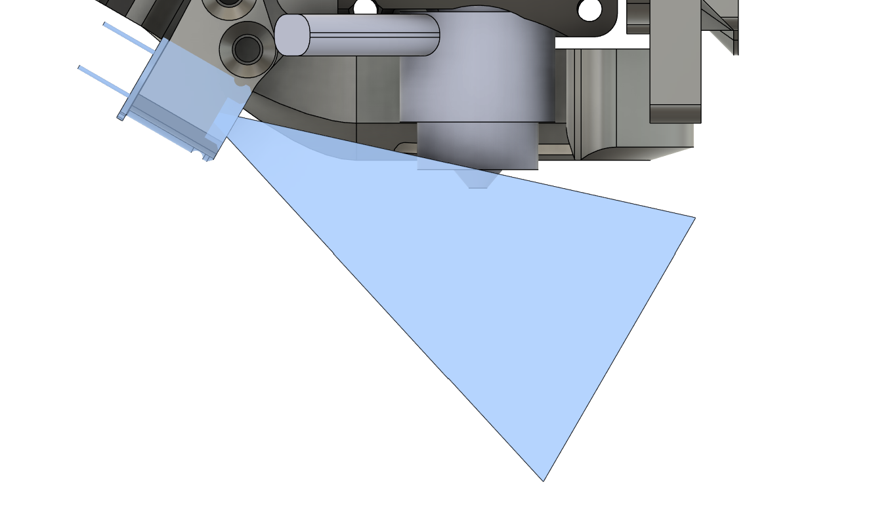
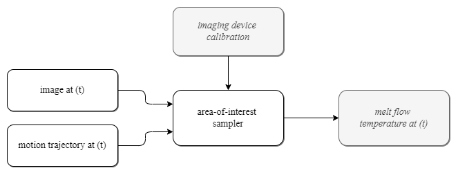
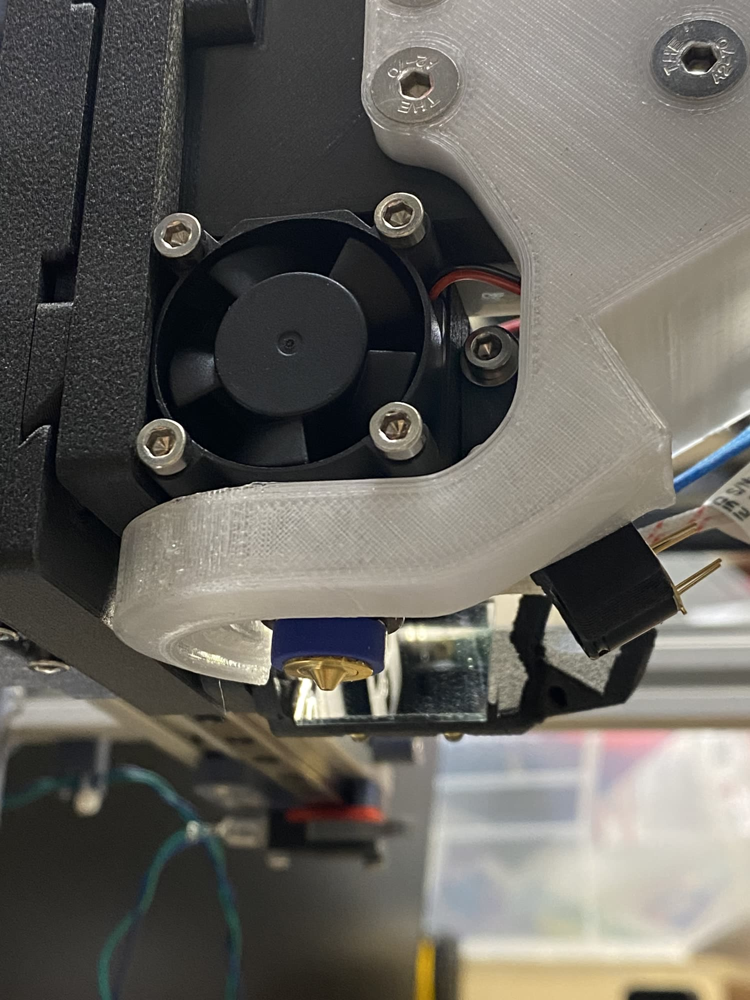

# Realtime Measurement of Extrudate Flow Temperatures and Width 

> Originally published to https://github.com/jakeread/realtime-melt-flow-measurements in the wee hours of March 11th, 2025 

> Mirrored to https://gitlab.cba.mit.edu/jakeread/realtime-melt-flow-measurements on March 13th, 2025 

> I hereby dedicate the contents of this disclosure to the public domain so that it may serve as prior art.  

When controlling melt flows in FFF or pellet-based additive manufacturing, the nozzle temperature is a main control variable. This is obvious: the extrudate temperature has a huge effect on the materials' viscosity. 

  
> As a refresher, in polymer extrusion additive manufacturing, we push solid filament into a heated zone (the 'melt zone') and subsequently push it out of a nozzle. Depending on the speed of the melt flow, the polymer spends different amounts of time in the heat zone: high speeds correspond to low 'residence times' and low speeds correspond to large residence times. 

  
> In this model of melt flow generated in an instrumented FFF machine [from this paper](https://link.springer.com/article/10.1007/s40192-024-00350-w) [pdf](assets/s40192-024-00350-w.pdf), we see that nozzle temperature has large impact on the pressures required to extrude at a given flow. 

However, printers cannot control the melt flow temperature directly: we control the temperature of the nozzle and rely on conduction to heat the flow. Thermistors are typically placed as close as is possible to the nozzle (and some systems use multiple thermistors) but the flow is not directly measured. 

|  |  |
| --- | --- |
> The E3D V6 hotend via [E3D](https://e3d-online.com/blogs/news/the-e3d-v6-hotend-design-and-details) (left) mounts the thermistor (blue wires) in a small hole beside the nozzle. The E3D Revo hotend (right) integrates the thermistor and heating element in a cartidge (black cylinder near the red nozzle) to bring it closer to the nozzle itself. 

Because heating the polymer takes time, and the thermistor is embedded in a relatively large thermal mass, the nozzle temperature measurement is lossy. When flowrates are high (and residence times are low) melt flow temperature may differ significantly from the nozzle's setpoint. This makes control of machines, and tuning of control parameters, more difficult. 

However, thermal imaging devices are decreasing in cost, and the availability of high powered compute in real-time applications is increasing. In this disclosure, I propose a system for measuring melt flow extrudate temperature just after it has left the nozzle using a combination of machine-mounted thermal imaging devices, and improved with prior information from the machine's motion control system, which can help to identify where in the image plane we should expect to see the extrudate. 

## The Device

  
  
> This design mounts a thermal imaging device (an MLX90614) alongside an E3D Revo hotend in an FFF extruder design. The device (and FOV, in blue) is positioned such that the nozzle tip is visible in frame. Other designs may use multiple cameras to enable measurements in any printing direction, or use other styles of imaging device. 

In this scheme, we put a thermal imaging device nearby the nozzle, ideally so that the nozzle tip is visible in the device's field of view (FOV) although this is not a strict requirement. We then calibrate the camera's FOV with respect to the machine's motion system, making a projection between pixels in the camera's FOV and the 3D volume around the nozzle. The calibration gives us the equation for each ray eminating from each pixel in the imaging device. 

When we capture data from the imaging device, we can reconile the pixels in our image with the recent motion history of the machine, and identify the pixels in the frame where the melt flow aught to be located. For example, if the machine was moving along the vector between the camera and the nozzle, the area of interest is just 'under' the nozzle's position on the image plane. If the machine was towards the left of the frame, the area of interest is to the right of the nozzle's position in the image plane, etc. 

It is sometimes difficult to trigger camera frame captures at precise times, and frames can rarely be captured synchronously - they must be loaded into the camera's RAM, and then transmitted to the machine's controller. While these delays are small, printers are fast and motion states are likely to change in the interval between capture and processing. In these scenarios, it is possible to time-stamp the camera's frame (at the source) and use motion history stored in the machine's controller to apply the motion prior. 

Depending on the imaging device's FOV, only some portion of machine travel directions will produce viable measurements: when the machine is traveling *towards* the imaging device, most of the melt flow will be obscured by the nozzle itself. To counter this, any number of imaging devices can be deployed around the nozzle, and device images can be selected appropriately. Samples from each camera can also be combined to produce a higher fidelity flow temperature estimate. 

## Extending to Measure Width 

Flow temperature information is useful at lower frequencies, since most hotends are limited in thermal slew rate (although inductive hotends, with much less thermal mass, will change this). This means that it is probably difficult to incorporate this style of measurement into a realtime feedback controller - although the information will be very useful in generating feed-forward control terms, which can ramp nozzle temperature when a series of fast motion is expected.

Width measurements *are* likely very useful in real-time control loops (in addition to their value in the longer term for data-based modeling of flow dynamics). Online width measurements are challenging because we cannot directly measure flow from a nozzle... very simply, it is challenging to put a flow sensor directly in-line with the nozzle for reasons that it is not hard to imagine. 

Normally, computer vision solutions for width measurements are challenging to develop because it is difficult to differentiate the new track of extrudate from the rest of the previously deposited tracks. This is alleviated with thermal imaging, because the most recent track is bound to be hotter than the background tracks. 

This means that we can extend our hotspot measurement to a width measurement, using gradients in the thermal image for edge detection. A slew of edge detection algorithms exist in the field of computer vision. In this proposed solution, we can use our priors from the motion controller to pick a pixel that is most likely to be in the center of the track, and find edges closest to this point. We can then use the calibration between camera pixels and 3D space to reconcile pixel width with real world widths. 

## The State of this Work

I developed a printer with two imaging devices in February of 2024, prior to delivering the machine to NIST. I have since improved the hotend design, and the current version of the hardware is shown below.

  

I have written a simple piece of firmware that can sample the device. That firmware runs a time synchronization routine that enables it to stamp the reading's capture time, and transmit that along with the frame to a motion controller. The controller saves motion history in RAM and past states can easily be queried at any time in the print's history. 

## Enumerations of Uses for Thermal and Width Information

Melt flow temperatures and flow widths can be used to develop and fit predictive models for flow, which are universally beneficial when developing controllers for the same. 

Temperatures and widths can of course be used as inputs to realtime feedback controllers as well. 

Measuring melt flow temperatures, alongside nozzle temperatures and residence times, should allow us to characterize the materials' thermal conductivity, which could aid in identifying materials. 

One of the main limits to wider adoption of additive components is their heterogeneity: each print may be slightly different than the last. Measuring melt flow as the part is printed, and subsequently recording it, would aid in developing complete digital twins of each unique part printed. These twins can aid in quality assurance, lifetime part tracking, and certification. Thermal history can also help us to study how (for example) layer adhesion strength changes under different processing conditions. 

It should be possible to take a series of frames, alongside concurrently captured motion data, to measure melt flow while also *scanning* the background of the frame, to image layers underneath the one currently being printed, or (for example) the adjacent tracks, further adding to a part's thermal history. 

## Enumerations of Variations

The strategy can be used with microbolometers, thermopile arrays, or any other form of thermal imaging device. Even single pixel devices can be used, although data would only be valid during particular directions of travel. Arrays of single pixel devices may be the route to developing a low cost, low fidelity version of this system. 

Even if we cannot measure the melt flow directly exiting the nozzle (i.e. if we cannot position the camera so that the nozzle tip is in the FOV), we can still estimate flow temperatures at the nozzle by estimating polymer cooling rate from the position of the first measure-able pixel to the nozzle... that is to say, we can measure a point a few millimeters away from the nozzle tip, and use path history to understand how long ago the measured track section left the nozzle. 

The system could be developed to suit non-planar printing, using more complex projections between the path history and the imaging device. 

The system can of course be developed for pellet extruders as well as filament extruders. 

A very simple implementation would simply find the 'hotspot' in the image and assume that is the most recently flowed chunk of material. This may be more computationally intensive, since it would require filtering the entire frame. The proposed solution effectively speeds up measurements by intelligently sampling the frame. 

It is possible to image multiple points on a path if i.e. we draw a small curved segment in the inter-frame gap, we can make multiple measurements along that path for higher frequency data (again, estimating a cooling rate based on the time between the materials' nozzle exit and its subsequent imaging). 

The approach may also be important for non-polymer flows: gels, clays, concrete, etc all have viscosities that change alongside their temperatures. 

## References

> Mackay, Michael E. 2018. “The Importance of Rheological Behavior in the Additive Manufacturing Technique Material Extrusion.” Journal of Rheology 62 (6): 1549–61. 

> Coogan and Kazmer. 2020. “Prediction of Interlayer Strength in Material Extrusion Additive Manufacturing.” Additive Manufacturing 35: 101368

> Go, Jamison, Scott N Schiffres, Adam G Stevens, and A John Hart. 2017. “Rate Limits of Additive Manufacturing by Fused Filament Fabrication and Guidelines for High-Throughput System Design.” Additive Manufacturing 16: 1–11. 

